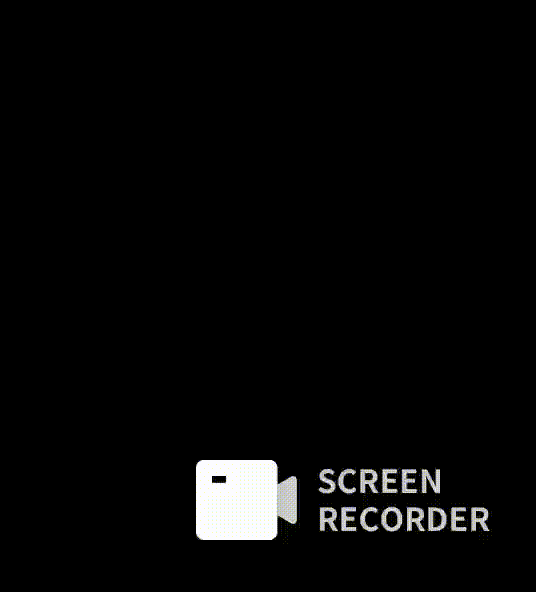

# <p align="center">📚 Readva</p>

<p align="center">
  
</p>

<p align="center">
  Uma plataforma web para acompanhar leituras, criar hábitos e tornar a experiência de leitura mais inteligente e divertida.
</p>

<p align="center">
  
  
  
  
</p>

---

# 🎥 Demonstração

### 🔎 Busca Inteligente

Busca automática de livros utilizando a **Google Books API** e **Open Library API**.

<p align="center">
  
</p>

---

### 📚 Biblioteca Interativa

Visualização do livro com estatísticas e animação de abertura inspirada em um livro físico.

<p align="center">
  
</p>

---

# ✨ Funcionalidades

- 📚 Biblioteca pessoal
- 🔎 Busca inteligente de livros
- 📖 Registro de sessões de leitura
- ⏱ Controle de tempo e páginas lidas
- 🔥 Sistema de Streak
- 🎯 Missões diárias e XP
- 🏆 Sistema de conquistas
- 📊 Estatísticas de leitura
- 👥 Feed social
- ❤️ Curtidas e comentários
- 🤖 Recomendações inteligentes
- 📖 Animação de virar páginas

---

# 🛠 Tecnologias

- Angular 22
- TypeScript
- SCSS
- Angular Material
- Angular Signals
- RxJS
- Local Storage

---

# 🌐 APIs

- Google Books API
- Open Library API

---

# 🏗 Arquitetura

O projeto utiliza uma arquitetura baseada em **Features**, separando cada funcionalidade em módulos independentes para facilitar manutenção e escalabilidade.

```
src
├── features
├── core
├── shared
├── constants
└── app
```

---

# 💾 Persistência

Atualmente o projeto utiliza **Local Storage**.

O backend será desenvolvido nas próximas versões, permitindo:

- Autenticação
- Banco de dados
- Sincronização entre dispositivos
- Recursos sociais completos

---

# 🚀 Executando o projeto

Clone o repositório

```bash
git clone https://github.com/thafisG/readva.git
```

Entre na pasta

```bash
cd readva
```

Instale as dependências

```bash
npm install
```

Execute a aplicação

```bash
ng serve
```

Acesse

```text
http://localhost:4200
```

---

# 🚧 Roadmap

- ✅ Biblioteca
- ✅ Feed Social
- ✅ Estatísticas
- ✅ Gamificação
- ✅ Sistema de Recomendações
- ✅ Animação de abertura dos livros
- 🚧 Backend
- 🚧 Banco de Dados
- 🚧 Perfil do usuário
- 🚧 Responsividade
- 🚧 Clubes de leitura

---

# 🌟 Diferenciais

O Readva vai além de um simples catálogo de livros.

- 📖 Diário de leitura
- 📊 Dashboard analítico
- 🎯 Gamificação
- 🤖 Recomendações inteligentes
- 👥 Rede social para leitores
- 📚 Biblioteca interativa

---

# 👩‍💻 Desenvolvido por

**Thais Guedes**

⭐ Se gostou do projeto, deixe uma estrela no repositório!
